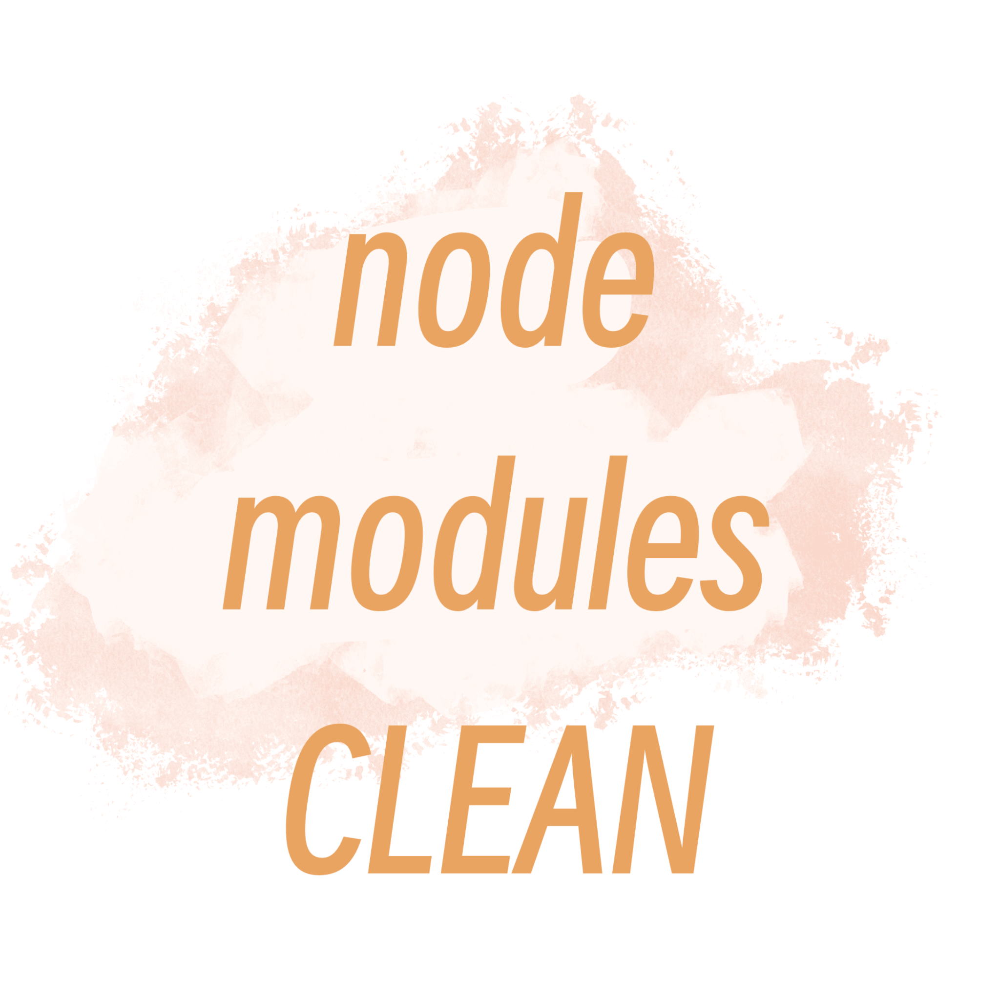
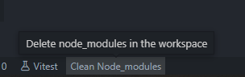

# Node Modules Clean

  

Don't you find it troublesome to manually delete node_modules in VS Code

Then use my plugin

1. 🚀 Quick and easy removal of cluttered node_modules directories
  
2. 🖱️ Simple one-click operation for clearing node_modules in **monorepo** projects
   
3. 👍 No complicated settings or configurations required - just install and use

  

## License

[MIT](./LICENSE) License © 2022 [Jaw](https://github.com/jaw52)
